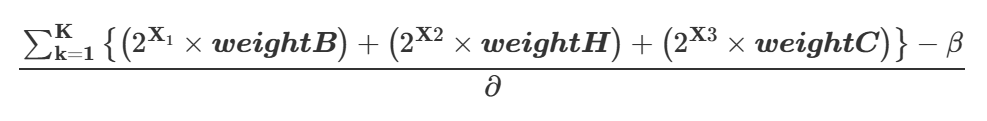

# GA-Road-design-to-improve-biodiversity-and-soil-loss-risk

1. Introduction

  Roads are essential for development, but construction in mountainous areas often causes serious environmental damage, including habitat loss and landslides. In countries like Korea, where 67% of the land is mountainous, this is a critical issue. Traditional road planning methods rely on expert judgment and often overlook environmental impacts. Although GIS and optimization tools exist, they usually prioritize cost over ecology and are less effective in complex terrains.

2. Problem Statement

  Mountain road construction must balance cost, biodiversity, and environmental risk. Existing methods, like GIS and linear optimization, rarely address these trade-offs effectively. This study introduces a genetic algorithm (GA) to optimize road routes by maximizing biodiversity conservation, minimizing soil erosion, and reducing construction costs. The goal is to support more sustainable and informed planning decisions.

3. Objective Function

  The model combines three key objectives:

1. Maximize biodiversity conservation

2. Minimize soil erosion risk

3. Minimize construction costs

Each factor is graded on five levels, with Grade 1 indicating the highest priority. A fitness function evaluates routes based on these criteria, using weights and grading values to balance trade-offs and guide the selection of environmentally sustainable, cost-effective paths.

Where:

K = Length of the chosen road path (in number of cells).

X = Grade level for each objective (biodiversity conservation, hazard probability, and
low-cost areas)

weightB, weightH, and weightC represent the weights for biodiversity conservation,
hazard probability (soil erosion), and low-cost areas, respectively.

β = Sum of values along the direction of the path

∂ = Decided constant
